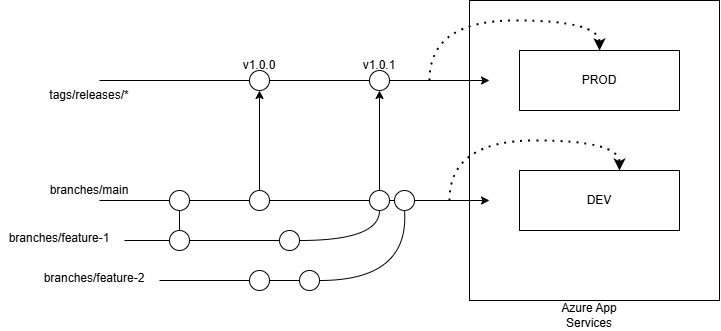

## Technical Objectives

### The repository follows best practices for access control and governance.

Measures taken
- Created Org and Teams (Leads, QA and DevOps) with appropriate permissions according to their responsibility.
- Enforced Code Owners.

### Changes are reviewed and approved appropriately before merging.
- Implemented Branch Protection rules
    - Mandated pull requests. 
    - Required at least 1 approval before merging. (Disabled temporarily because I'm the only contributor)
    - Required review from Code Owners.
    - Blocked force push to main branch. 
    - Automated tests need to pass before merging to main. 
    - Required branches to be up to date before merging and linear. 
    - Restricted deletion.
    - Required code scanning results. (Disabled temporarily)
    - Branching strategy compatible with trunk based development or github flow. 
    - Merge feature branches to main after ensuring tests are successful.  
        main --(deploy to)--> dev/staging  
        tags/releases/* --(deploy to)--> prod  
        `main` branch is deployed continously to `dev`/`staging` server. 
        Ensures that automated tests are successful and dev/users can verify the changes here.
        `main` to `prod` is only deployed on `releases/*` tags. This ensures that changes to `prod` can be batched. Also `prod` env has required reviewers to approve before pushing to `prod`. Both these act as gates to ensure that there are no accidental changes pushed to `prod`.

### Automation is in place to validate and deploy code efficiently, considering different environments.
- Managing dev and prod environments.
- Manual review before deploy to prod.
- Publish profiles for Azure App Service managed as Secrets
- Azure App names stored as env variables. 
- Enabled depandabot for automating security updates.

### A simple .NET application is built and deployed using GitHub Actions.
- Blazor App with tests included in /src/
- Deployed to Azure App Services in dev and prod instances. 

    Dev: https://dev-spiff.azurewebsites.net/  
    Prod: https://prod-spiff.azurewebsites.net/  

## Possible future enhancements 
- Enable Code signing and enforce 2FA org wide. 
- Optimize github actions to cache dependencies and save artifacts to re-use build outputs. 
-  Implement semantic versioning and tagging of containers, deploy the same container to multiple environments. 
